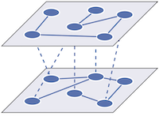

# Multilayer Modularity for Multi-frequency EEG Network Analysis

This repo includes codes to run multilayer modularity based community detection in multi-frequency EEG networks as described in [[1]](#1). Although the paper's focus is EEG networks, the method can be applied to any type of multilayer networks. Here, a multilayer graph refers to a layered network with both intra- and inter-layer edges as depicted in the following figure:



## Installation

Once you download the repo, go to the repo directory and start a terminal.
First, create an environment and then install the required packages listed in
`enviroment.yml`. This can be done as follows for conda:
```sh
conda env create -f environment.yml
```
Then activate the environment.
```sh
conda activate mlmodularity
```

## Usage

Please see `demo.ipynb` under notebooks folder. 

## References

<a id="1">[1]</a> Karaaslanli, A., Ortiz-Bouza, M., Munia, T. T., & Aviyente, S. (2023). Community detection in multi-frequency EEG networks. Scientific Reports, 13(1), 8114.